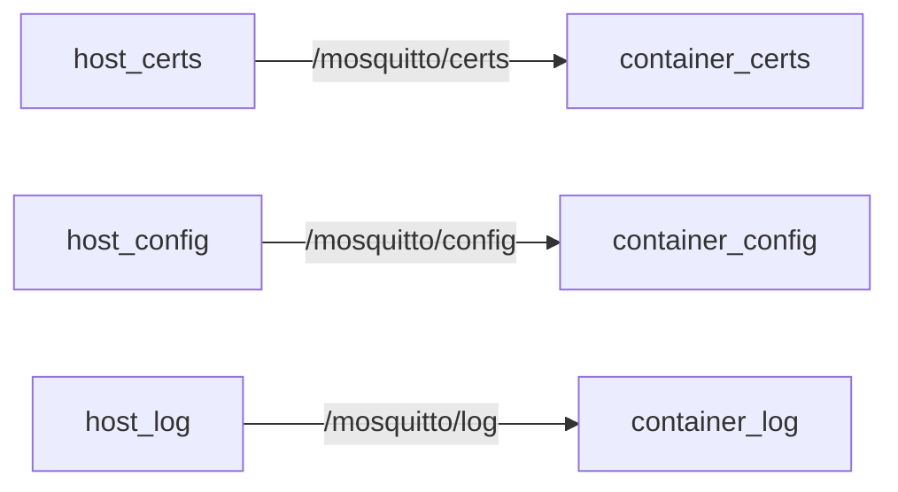

# 🔐 Mosquitto Broker with TLS + Python Automation

> Complete project for a secure MQTT broker with **TLS** support, authentication via **username and password**, automated **certificate generation**, **Docker** integration, and compatibility with **Linux** and **Windows** 🐧🪟.

## 📋 Requirements

### 🖥️ System Requirements

- **Docker** + **Docker Compose** (v2.0+)
- **Python 3.8+** (with pip)
- **Poetry 1.2+** (for dependency management)
- **OpenSSL** (for certificate generation)
- **Mosquitto Tools** (for password hashing)
  - Linux: `sudo apt-get install mosquitto-clients`
  - Windows: [Mosquitto Windows Installer](https://mosquitto.org/download/)

### 📦 Python Dependencies

```bash
poetry install  # Installs:
# - cryptography
# - python-dotenv
# - paho-mqtt
```

## 🛠 Setup Guide

### 1️⃣ Clone the Repository

```bash
git clone https://github.com/andersonlimacrv/docker-mosquitto.git
cd broker_mosquitto
```

### 2️⃣ Environment Configuration

Create `.env` file (template provided):

```bash
cp .env.example .env
nano .env  # Edit with your credentials
```

Example `.env`:

```ini
# User Credentials
USER_1=admin
PASS_1=StrongPassword!123
USER_2=client
PASS_2=AnotherSecurePass

# Broker Configuration
BROKER_CN=mqtt.yourdomain.com  # Must match TLS cert
```

### 3️⃣ Certificate Authority Setup

```bash
poetry run generate-ca
```

Generates:

- `certs/ca.key` (keep this secure!)
- `certs/ca.crt` (distribute to clients)

### 4️⃣ Broker Certificate Generation

```bash
poetry run generate-broker-cert $BROKER_CN --days 365
```

### 5️⃣ Client Certificates (Optional)

For each client:

```bash
poetry run generate-cert client_name 365
```

### 6️⃣ Password File Generation

```bash
poetry run generate-pass
```

Creates hashed passwords in `config/mosquitto.passwd`

### 7️⃣ Start the Broker

```bash
docker-compose up -d
```

---

## 🧪 Verification Steps

### Test Password Authentication

```bash
poetry run test-mqtt admin StrongPassword!123 client_name
```

### Verify Certificate Chain

```bash
poetry run verify-cert client_name
```

### Check Broker Logs

```bash
tail -f log/mosquitto.log
```

---

## 🐳 Docker-Specific Notes

### Port Mapping

| Container Port | Host Port | Protocol | Purpose               |
| -------------- | --------- | -------- | --------------------- |
| 8883           | 8883      | TCP      | MQTT over TLS         |
| 9001           | -         | TCP      | Websockets (disabled) |

### Volume Mounts



---

## ⚠️ Security Checklist

- [ ] Change default passwords in `.env`
- [ ] Set proper file permissions:
  ```bash
  chmod 600 certs/*.key config/mosquitto.passwd
  ```
- [ ] Rotate certificates annually
- [ ] Restrict Docker network access
- [ ] Enable firewall rules for port 8883

---

## 🔄 Maintenance

### Renewing Certificates

```bash
poetry run generate-broker-cert $BROKER_CN --days 90  # Short-lived cert
docker-compose restart mosquitto
```

### Adding New Users

1. Add to `.env`:
   ```ini
   USER_3=newuser
   PASS_3=newpass123
   ```
2. Regenerate password file:
   ```bash
   poetry run generate-pass
   ```
3. Restart broker:
   ```bash
   docker-compose restart mosquitto
   ```

---

## 📂 Project Structure

```
📁 BROKER_MOSQUITTO
├── 📄 .env
├── 📄 docker-compose.yml
├── 📄 README.md
├── 📁 certs
│   ├── 📄 ca.crt                     ⚠️
│   ├── 📄 ca.key                     ⚠️
│   ├── 📁 broker                     ⚠️
│   │   ├── 🔐 broker.key             ⚠️
│   │   ├── 📜 broker.csr             ⚠️
│   │   └── 📄 broker.crt             ⚠️
│   └── 📁 client
│       └── 📁 anderson               ⚠️
│           ├── 🔐 anderson.key       ⚠️
│           ├── 📜 anderson.csr       ⚠️
│           └── 🧾 anderson.crt       ⚠️
├── 📁 config
│   ├── ⚙️ mosquitto.conf
│   └── 🔐 mosquitto.passwd           ⚠️
├── 📁 log
│   └── 📄 mosquitto.log
├── 📁 mosquitto_auth
│   ├── 🧾 verify_certificate.py
│   ├── 📁 client
│   │   ├── 🧪 generate_users_certificate.py
│   │   └── 🔐 generate_users_password.py
│   ├── 📁 broker
│   |   └── 🧪 generate_broker_certificate.py
|   └── 📁 ca
│       └── 🧪 generate_ca.py
|
└── 📁 tests
    └── 🧪 mqtt_client.py
```

> All folders market with ⚠️ was script-generated.

## 🚀 Features

✅ Secure authentication with `mosquitto_passwd`<br>
✅ Python scripts for certificate generation/validation<br>
✅ Full Docker + TLS support<br>
✅ Automated using **Poetry**<br>
✅ Compatible with Linux 🐧 and Windows 🪟<br>

## ⚙️ Automated Scripts

> All scripts are ready to run with `poetry run` or their respective shortcut:

- `generate-pass` = "mosquitto_auth.generate_users_password:main"
- `generate-ca` = "mosquitto_auth.ca.generate_ca:main"
- `generate-cert` = "mosquitto_auth.generate_users_certificate:main"
- `generate-broker-cert` = "mosquitto_auth.broker.generate_broker_certificate:main"
- `verify-cert` = "mosquitto_auth.verify_certificate:main"
- `test-passwords` = "tests.mqtt_client:test_password_generation"
- `test-mqtt` = "tests.mqtt_client:test_mqtt_connection"

<br>

# 📘 **How to set a `.env` file**

#### 🔐 Generate Secure Mosquitto Passwords from `.env`

> This script generates a `mosquitto.passwd` file using user credentials defined in a `.env` file.

### 📄 `.env` Format

Add user credentials with this pattern:

```env
USER_1=alice
PASS_1=securepassword123

USER_2=bob
PASS_2=anothersecurepassword
```

> You can define multiple users by following the naming pattern `USER_x` and `PASS_x`, where `x` is a numeric index (e.g., `USER_1`, `PASS_1`, `USER_2`, `PASS_2`, etc.).
> Simply increment the number for each additional user — in this case, the next user would be defined as `USER_3` and `PASS_3`.

---

### 🚀 Usage

```bash
poetry run generate-pass
```

> Or use Python directly if not using Poetry:

```bash
python generate_users_password.py
```

---

### ✅ Output

- The script will create or replace the file at:

  ```
  config/mosquitto.passwd
  ```

- It will contain all users listed in the `.env`.
- Terminal:
  ```bash
  ✅ File config\mosquitto.passwd successfully updated with 4 user(s)!
  ✅ Detected OS: Windows
  ```

### 💡 Features

- 🔍 Automatically detects the OS (Windows, Linux, etc.)
- 🔐 Uses `mosquitto_passwd` to hash and store passwords securely
- 🗑️ Deletes previous password file if it exists
- 📂 Ensures the `config/` directory exists

---

### ⚠️ Troubleshooting

- **Windows users:** Make sure Mosquitto is installed at:

  ```
  C:\Program Files\mosquitto\
  ```

- **Linux users:** Install with:

  ```bash
  sudo apt-get install mosquitto
  ```

## 🔐 CA and Broker Certificate Generation

### 🏢 Generate **CA (Certificate Authority)**

This is the first step. The CA will be used to sign both broker and client certificates.

```bash
poetry run generate-ca
```

📁 Output:

- `certs/ca.key` — CA private key
- `certs/ca.crt` — CA public certificate
- `certs/ca.srl` — CA serial (generated automatically)

---

### 🌐 Generate the **broker certificate** (with IP or domain)

This step **requires** a Common Name (CN), which is the IP address or domain where the broker will be accessed (e.g., `mqtt.example.com` or `192.168.0.10`).

```bash
poetry run generate-broker-cert <CN> [--days N]
```

#### ✅ Examples

- **Default (365 days):**

```bash
poetry run generate-broker-cert mqtt.example.com
```

- **Custom validity (e.g., 730 days):**

```bash
poetry run generate-broker-cert mqtt.example.com --days 730
```

📁 Output:

- `certs/broker/broker.key` — broker private key
- `certs/broker/broker.csr` — certificate signing request
- `certs/broker/broker.crt` — signed certificate by the CA

💡 **Important:**

- The CN **must match** exactly the domain/IP the MQTT client will use to connect to the broker.
- The CA must already be generated to sign the broker certificate.

---

### 📜 Generate Client Certificate

```bash
poetry run generate-cert anderson 365
```

📁 Automatically generates:

- `client/anderson/anderson.key`
- `client/anderson/anderson.csr`
- `client/anderson/anderson.crt`

---

### ✅ Verify Certificate

```bash
poetry run verify-cert anderson
```

🧪 Verifies:

- ✔️ Validity (expiration date)
- 📆 Active period
- ❌ Expired or invalid certificates

---

### ✅ Test connection with broker using generated certificate

To test the connection to the MQTT broker using **TLS** and **user/password authentication**, run:

```bash
poetry run test-mqtt <username> <password> <CN_CLIENT>
```

#### 🔧 Required parameters:

- `<username>` — MQTT username (must be in `.env` and `mosquitto.passwd`)
- `<password>` — Corresponding password
- `<CN_CLIENT>` — Client Common Name (CN), used to find the right certificates (e.g., `anderson`)

#### 🧪 Practical example:

```bash
poetry run test-mqtt admin1 admin1 anderson
```

#### 📋 What this command does:

The script `tests/mqtt_client.py` performs:

1. **Loads variables** and arguments
2. **Establishes a secure TLS connection** to the MQTT broker using:

   - **CA certificate** (`certs/ca.crt`)
   - **Client certificate and key** (`certs/client/<CN_CLIENT>/*.crt` and `*.key`)

3. **Authenticates using the provided username and password**
4. **Publishes a test message** to the topic `test/connection`
5. **Ends the session**, with terminal feedback

#### ✅ Prerequisites:

- CA, broker, and client certificates must already be created
- User and password must be set in `.env` and generated via:

```bash
poetry run generate-pass
```

- The broker must be **running** with:

```bash
docker-compose up -d
```

---

## 📌 Example Output

### ✅ Successful connection:

```
🚀 Starting secure MQTT connection test
🔐 Authentication and TLS enabled
👤 Username: admin1
📄 Certificate CN: anderson
📁 Certificates loaded successfully

🌐 Connecting to localhost:8883 ...
🔄 TLS handshake in progress...

🔍 Connection result:
================================================================================
🔢 Return code: 0
📬 Status: ✅ Connection established successfully (valid TLS and authentication)
📡 Publishing test message to 'test/connection' topic...
================================================================================
✅ Test message published successfully!
================================================================================

📡 Disconnecting...
```

### ❌ Example error output:

```
❌ TLS setup error: [Errno 2] No such file or directory
🔎 Check certificate file paths:
   📄 CA:    /path/to/project/certs/ca.crt
   📄 Cert:  /path/to/project/certs/client/anderson/anderson.crt
   🔑 Key:   /path/to/project/certs/client/anderson/anderson.key
```

---

### ℹ️ Return Codes (RC)

| Code  | Meaning                          |
| ----- | -------------------------------- |
| 0     | ✅ Successfully connected        |
| 1     | 🚫 Invalid MQTT protocol version |
| 2     | 🚫 Invalid client identifier     |
| 3     | 🚫 MQTT broker unavailable       |
| 4     | 🚫 Invalid username or password  |
| 5     | 🚫 Access denied by ACL rules    |
| 6     | 🚫 Other failure reasons         |
| 7–255 | ❗ Reserved / unknown error      |

---

## 🐳 Docker Compose (Mosquitto TLS)

```yaml
services:
  mosquitto:
    image: eclipse-mosquitto:2.0.21-openssl
    container_name: mosquitto
    restart: unless-stopped
    user: "mosquitto:mosquitto"
    volumes:
      - ./certs:/mosquitto/certs:rw
      - ./config/mosquitto.conf:/mosquitto/config/mosquitto.conf:rw
      - ./config/mosquitto.passwd:/mosquitto/config/mosquitto.passwd:rw
      - ./log:/mosquitto/log:rw
    ports:
      - "8883:8883"
    networks:
      - mqtt_network
    environment:
      - TZ=America/Sao_Paulo

networks:
  mqtt_network:
    driver: bridge
```

📌 Uses secure port (`8883`) with bind-mounted certificates.

## 🌐 Compatibility

| Operating System | Supported |
| ---------------- | --------- |
| 🐧 Linux         | ✅        |
| 🪟 Windows       | ✅        |
| 🐳 Docker        | ✅        |

> Scripts use compatible libraries (`pathlib`, `subprocess`) for both POSIX and NT environments.

## 🔁 Automation Benefits

✨ **Zero manual setup**<br>
🛡️ **Security by default**<br>
📦 **Production-ready**<br>
🔄 **Reusable in multiple projects**<br>
⚙️ **Developer friendly**<br>

## 🔗 Additional Documentation

For deeper technical details, refer to these specialized guides:

| Documentation                                   | Content Focus                                                                 |
| ----------------------------------------------- | ----------------------------------------------------------------------------- |
| [📜 **CERTIFICATE.md**](./CERTIFICATE.md)       | Complete TLS workflow: CA creation, broker/client certs, and OpenSSL commands |
| [📘 **MOSQUITTO_DOCS.md**](./MOSQUITTO_DOCS.md) | Broker configuration: ACLs, listeners, and security hardening                 |

---

### Key Features of Each Guide:

**`CERTIFICATE.md` Covers:**

- Certificate chain validation
- Script automation details
- Troubleshooting TLS errors

**`MOSQUITTO_DOCS.md` Includes:**

- Password encryption methods
- Port configuration
- Logging best practices

## 📜 LICENSE

MIT © Anderson Carvalho

## 📫 CONTACT

📧 Anderson Carvalho – [andersonlimacrv@gmail.com](mailto:andersonlimacrv@gmail.com)

🔗 Project focused on **IoT + Security + Automation**.

---
